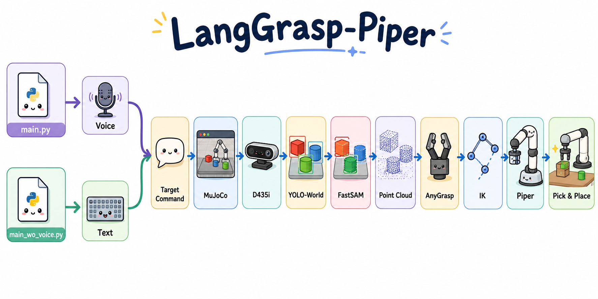
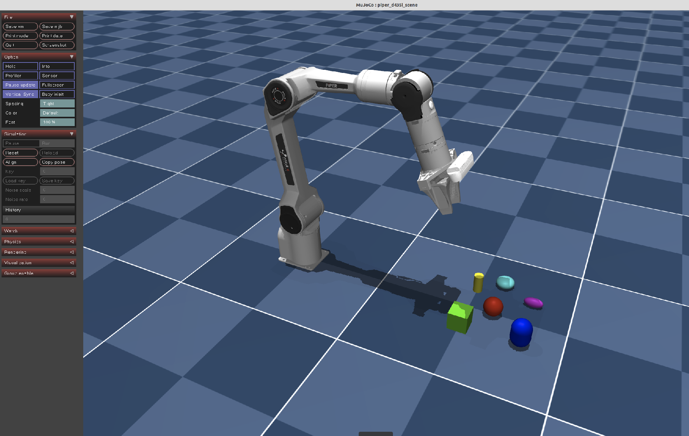
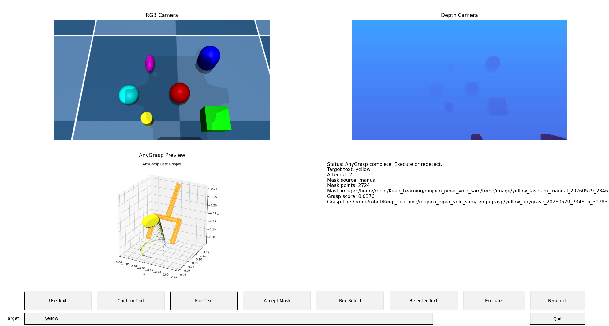

# LangGrasp-Piper

[English Version](README_en.md)

LangGrasp-Piper 是一个面向 Piper 机械臂的语言引导抓取实验项目。项目将 MuJoCo 仿真、D435i RGB-D 相机、YOLO-World 开放词汇检测、FastSAM 分割、AnyGrasp 抓取位姿生成、逆运动学与可选语音输入串成一条流程，让用户可以用文本或语音指定目标物体，并在仿真中完成抓取与放置。

项目目前偏研究和实验性质，适合用于学习机器人感知、语言 grounding、点云抓取、MuJoCo 机械臂控制等方向。

## 项目特性

- 语言引导抓取：输入目标文本，例如 `red cube`、`bottle`、`杯子`，系统尝试检测并抓取对应物体。
- 开放词汇检测：使用 YOLO-World，根据文本提示在 RGB 图像中定位目标。
- 自动/手动分割：使用 FastSAM 自动生成掩码，也支持在 Matplotlib 界面中手动框选目标区域。
- RGB-D 点云生成：从 MuJoCo 中的 D435i 相机渲染 RGB 和深度图，并转换为局部点云。
- AnyGrasp 抓取候选：基于目标点云生成抓取位姿，选择最佳抓取结果执行。
- Piper 机械臂控制：包含 MuJoCo 场景、Piper 模型、D435i 模型、夹爪控制和基础运动序列。
- 逆运动学求解：默认使用基于 MuJoCo/Scipy 的 IK，保留 IKPy 后端作为可选方案。
- 语音输入可选：支持 PyAudio 录音、Vosk 离线识别，以及腾讯云 ASR 在线识别。
- 无语音模式：`main_wo_voice.py` 支持纯文本输入，方便调试视觉和抓取流程。
- 日志记录：集成 NoPrint 日志工具，输出 `.log` 和 `.jsonl`，便于回放和排查。

## 项目结构

```text
.
├── main.py                         # 语音/文本完整流程入口
├── main_wo_voice.py                # 无语音文本输入流程入口
├── requirements.txt                # Python 依赖
├── pyproject.toml                  # 项目元数据与命令入口
├── script/
│   ├── setup.bash                  # 不创建环境：安装依赖并检查/下载模型
│   └── setup_wo_env.bash           # 创建/激活 conda 环境后调用 setup.bash
├── config/
│   ├── d435i_camera_params.yaml    # D435i 相机参数
│   ├── request.json                # 腾讯云 ASR 请求配置
│   └── TX-cloud_API.yaml.example   # 腾讯云密钥模板
├── model/
│   ├── FastSAM-x.pt                # FastSAM 权重，脚本会自动下载
│   ├── yolov8x-worldv2.pt          # YOLO-World 权重，脚本会自动下载
│   └── vosk-model-*                # Vosk 离线语音模型
├── piper_d435i/                    # MuJoCo Piper + D435i 场景和模型资产
├── src/
│   ├── Vision/                     # 检测、分割、点云、AnyGrasp 工作流
│   ├── Voice/                      # 录音、离线识别、腾讯云在线识别
│   ├── ik/                         # Piper 逆运动学控制器
│   ├── NoPrint/                    # 日志子模块
│   └── grasp_sequence.py           # 抓取/放置动作序列
├── third_party/
│   └── anygrasp_sdk/               # AnyGrasp SDK 子模块
└── temp/                           # 运行时日志、图片、抓取结果等临时输出
```

## 如何安装

推荐使用 Linux + Conda。项目依赖 MuJoCo、Open3D、Torch、OpenCV、PyAudio 等包，直接装在系统 Python 里容易把环境搅乱。

### 1. 克隆仓库

```bash
git clone --recursive https://github.com/LiO2-coder/LangGrasp-Piper.git
cd LangGrasp-Piper
```

如果已经克隆但没有拉子模块：

```bash
git submodule update --init --recursive
```

### 2. 一键创建环境并安装

```bash
./script/setup_wo_env.bash
```

默认会创建名为 `mujoco` 的 conda 环境，并使用 Python `3.10`：

```bash
ENV_NAME=mujoco PYTHON_VERSION=3.10 ./script/setup_wo_env.bash
```

### 3. 已有环境时安装

如果你已经手动创建并激活了环境，可以只运行：

```bash
conda activate mujoco
./script/setup.bash
```

`script/setup.bash` 只做三件事：

- 安装 `requirements.txt`
- 单独以 `--no-deps` 安装 `graspnetAPI==1.2.11`
- 检查并下载 `model/FastSAM-x.pt` 和 `model/yolov8x-worldv2.pt`

### 4. 配置AnyGrasp

运行anygrasp因为版权问题，需要获得授权，这个需要填写表单并填写自己的机器码。等待2天左右将收到回执邮件，邮件中包含个人机器的注册文件和权重的下载链接。

详细参考[Anygrasp 2025年配置教程](https://zhuanlan.zhihu.com/p/1924881466229233373)

### 5. 配置腾讯云 ASR（可选）

如果要使用在线语音识别，请参考[腾讯云文档API说明](https://console.cloud.tencent.com/api/explorer?Product=asr&Version=2019-06-14&Action=CreateRecTask)
复制模板并填入自己的密钥：

```bash
cp config/TX-cloud_API.yaml.example config/TX-cloud_API.yaml
```

也可以使用环境变量：

```bash
export TENCENTCLOUD_SECRET_ID="你的 SecretId"
export TENCENTCLOUD_SECRET_KEY="你的 SecretKey"
export TENCENTCLOUD_REGION="ap-guangzhou"
```

不要把你真实的 `config/TX-cloud_API.yaml` 提交到 Git，云服务要钱的！

## 依赖

主要 Python 依赖包括：

- `mujoco`：MuJoCo 物理仿真与渲染
- `numpy` / `scipy`：数值计算、逆运动学优化
- `opencv-python` / `Pillow`：图像处理
- `matplotlib`：交互式主控界面
- `open3d`：点云处理与可视化
- `ultralytics`：YOLO-World 与 FastSAM 推理
- `torch`：深度学习推理后端
- `PyAudio` / `vosk` / `tencentcloud-sdk-python-asr`：语音输入与识别
- `ikpy`：可选 IK 后端
- `graspnetAPI`：AnyGrasp 结果结构支持

注意：`graspnetAPI==1.2.11` 的包元数据会强制要求 `numpy==1.20.3`，与本项目的现代依赖栈冲突。因此它没有写入 `requirements.txt`，而是在 `script/setup.bash` 中使用 `pip install --no-deps` 单独安装。

系统侧建议准备：

- Conda / Miniconda
- 可用的 OpenGL/GLFW 环境
- 麦克风设备（仅语音模式需要）
- NVIDIA GPU 与 CUDA（推荐，但不是所有调试步骤都强制需要）

## 快速开始

### 文本输入模式

```bash
conda activate mujoco
python main_wo_voice.py
```

启动后在 Matplotlib 界面中输入目标文本，确认检测、分割和抓取结果，再执行抓取动作。

### 语音输入模式

```bash
conda activate mujoco
python main.py
```

点击 `Record` 开始录音，再次点击停止录音。系统会优先尝试腾讯云 ASR；网络不可用或在线识别失败时，会回退到 Vosk 离线识别。

### 演示截图





## 说明

- 模型权重 `FastSAM-x.pt` 和 `yolov8x-worldv2.pt` 体积较大，默认不建议直接提交到 Git；安装脚本会在缺失时下载。
- 运行产生的日志、图片、抓取 JSON、点云文件等会写入 `temp/`。
- `config/TX-cloud_API.yaml` 是本地密钥文件，已被 `.gitignore` 忽略。
- AnyGrasp SDK 作为子模块位于 `third_party/anygrasp_sdk`。如果你的运行配置仍指向相邻目录 `../anygrasp_sdk/grasp_detection`，请保持本地路径一致，或在代码配置中改为 `third_party/anygrasp_sdk/grasp_detection`。
- 当前项目主要面向仿真环境，真实机械臂部署需要额外处理标定、安全限位、碰撞检测、急停和硬件通信。
- MuJoCo 渲染依赖本机图形环境；在无显示器服务器上运行时，可能需要配置 EGL、虚拟显示或远程图形转发。

## TODO: 开发计划(作者给自己画饼)

- [ ]  使用 Piper 机械臂夹爪上已有的压力传感器，接入抓取力控流。
- [ ]  做一个更顺手的 GUI，把检测、掩码、点云、抓取候选放在同一个工作台里。
- [ ]  支持多物体任务，例如“把红色方块放到蓝色盒子里”。
- [ ]  增加自动失败恢复：检测失败重试、抓取失败换候选、IK 失败重新规划。
- [ ]  加入严格的碰撞检测和轨迹平滑。
- [ ]  Sim2Real对接真实 Piper 机械臂，把仿真流程迁移到实机。

## 贡献

欢迎提交 Issue、PR 或实验记录。比较建议的贡献方式：

- 报告安装问题时附上系统版本、Python 版本、CUDA/Torch 版本和完整报错。
- 修改视觉或抓取流程时，尽量附带一组可复现实验截图或日志。
- 不要提交密钥、临时日志、模型大文件、`__pycache__`、本地虚拟环境。
- 如果新增第三方模型或 SDK，请说明来源、许可证和下载方式。

## 鸣谢

本项目感谢许多教学博主和优秀开源项目和：

- B站MuJoCo教学博主 [材机战士](https://github.com/Albusgive)
- 知乎AnyGrasp教学博主 [忘中犹记ZihaoLiu](https://www.zhihu.com/people/clsr-44)
- 灵感来源B站博主 [猪猪呀咋](https://space.bilibili.com/3632305260202417?spm_id_from=333.788.upinfo.detail.click)
- MuJoCo：物理仿真与机器人建模
- Ultralytics / YOLO-World：开放词汇目标检测
- FastSAM：快速分割模型
- AnyGrasp / GraspNet：抓取位姿生成与抓取数据生态
- Open3D：点云处理与可视化
- Matplotlib：交互式调试界面
- Vosk：离线语音识别
- Tencent Cloud ASR：在线语音识别
- NoPrint：本项目使用的日志辅助工具
- AgileX Piper 与 RealSense D435i 相关模型资产

## 许可证

本项目采用 MIT 许可证 - 查看 [LICENSE](LICENSE) 文件了解详情。

第三方模型、SDK、预训练权重、机器人资产和语音服务分别遵循其原始项目或服务条款。使用、分发或商用前，请自行确认对应许可证。

## 作者

- **GitHub**: [https://github.com/LiO2-coder](https://github.com/LiO2-coder)

项目名：LangGrasp-Piper

方向：语言引导机器人抓取、仿真感知、机器人学习工具链

## 版本历史

### v1.0

- 搭建 MuJoCo Piper + D435i 仿真场景。
- 接入 YOLO-World、FastSAM、AnyGrasp。
- 增加 Matplotlib 交互式抓取流程。
- 增加文本输入模式与语音输入模式。
- 增加安装脚本、依赖文件和模型自动下载逻辑。
- 增加基础日志记录与运行结果保存。

## 支持

如果运行失败，优先检查这些信息：

```bash
python --version
python -m pip list | grep -E "mujoco|torch|ultralytics|open3d|numpy|scipy|graspnet"
git submodule status
ls -lh model/
ls -lh temp/log/
```

常见问题包括：

- `graspnetAPI` 和 `numpy` 依赖冲突：请使用 `script/setup.bash`，不要手动让 pip 解析安装 `graspnetAPI` 的依赖。
- 找不到模型权重：确认 `model/FastSAM-x.pt` 和 `model/yolov8x-worldv2.pt` 存在。
- 找不到 AnyGrasp checkpoint：确认 AnyGrasp SDK 已拉取，并检查代码配置的 SDK 路径。
- PyAudio 安装失败：优先使用 conda 安装 `portaudio`，再安装 Python 依赖。
- 腾讯云 ASR 失败：检查密钥、地域、网络；也可以先使用无语音模式调试视觉流程。

需要帮助时，请带上完整报错、运行命令、系统环境和最新日志文件路径。日志通常位于 `temp/log/`。

您可以通过以下方式联系：

- GitHub Issues: [项目 Issues 页面](https://github.com/LiO2-coder/EasyFilter/issues)

---

⭐ 如果这个项目对您有帮助，请给个Star！
